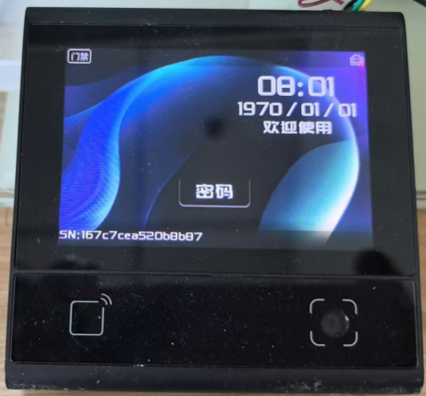

# DW200_V10 Access Control Application

## Overview

This is the official standard access control application for DW200_V10 devices. It provides a comprehensive access control solution with rich functionality for secondary development. The application is designed to be highly portable and can be easily adapted to other devices with minimal code changes.

**Version**: DW200_V10_access_2.0.0.2

## Screenshots

### Main Interface

The main access control interface showing time, date, device name, and authentication options:



### Password Input Interface

The secure PIN entry keypad for password authentication:


## Features

### Core Access Control

- **Multi-authentication Methods**: Supports QR code scanning, NFC card reading, password input
- **Door Control**: Smart relay control with configurable open/close modes
- **Access Logging**: Complete access record management with SQLite database
- **Offline/Online Verification**: Flexible authentication modes with fallback support

### Hardware Interface Support

- **GPIO Control**: Relay control for door locks and other devices
- **PWM Audio**: Buzzer control for audio feedback
- **Network Connectivity**: Ethernet, WiFi, and 4G support
- **QR Code Scanner**: High-performance barcode/QR code recognition
- **NFC Reader**: M1 card and EID support with configurable sectors
- **Audio System**: Voice prompts and sound feedback
- **UART Bluetooth**: BLE communication support
- **Watchdog**: System stability monitoring

### User Interface

- **Modern UI**: Clean and intuitive interface design
- **Multi-language Support**: Chinese and English language options
- **Customizable Themes**: Configurable backgrounds and fonts
- **Real-time Status**: Network, MQTT, and system status indicators
- **Responsive Design**: Support for multiple screen orientations

### Network & Communication

- **MQTT Integration**: Real-time messaging and remote control
- **RESTful APIs**: HTTP-based configuration and monitoring
- **Network Management**: Auto-configuration and status monitoring
- **Time Synchronization**: NTP support for accurate timekeeping

### Configuration Management

- **Comprehensive Settings**: Over 50 configurable parameters
- **Hot Reload**: Dynamic configuration updates without restart
- **Backup & Restore**: Configuration import/export capabilities
- **Security**: Encrypted configuration protection

## Architecture

### Directory Structure

```
src/
├── view/                    # UI Components
│   ├── mainView.js         # Main interface
│   ├── passwordView.js     # Password input interface
│   └── popWin.js           # Popup windows
├── service/                 # Business Services
│   ├── accessService.js    # Access control logic
│   ├── sqliteService.js    # Database operations
│   ├── mqttService.js      # MQTT communication
│   ├── codeService.js      # QR code processing
│   ├── nfcService.js       # NFC card processing
│   ├── configService.js    # Configuration management
│   └── ...
├── common/                  # Shared Utilities
│   ├── utils/              # Utility functions
│   └── consts/             # Constants definitions
├── main.js                 # Application entry point
├── controller.js           # Main controller
├── driver.js               # Hardware drivers
├── screen.js               # UI management
├── services.js             # Service orchestration
└── config.json             # Default configuration
```

### Core Components

#### 1. Main Controller (`main.js`)

- Application bootstrap and initialization
- Worker thread management
- Event bus setup
- System lifecycle management

#### 2. Hardware Drivers (`driver.js`)

- **GPIO Driver**: Door lock control and digital I/O
- **PWM Driver**: Buzzer and audio feedback
- **Network Driver**: Ethernet/WiFi/4G connectivity
- **Scanner Driver**: QR code and barcode recognition
- **NFC Driver**: RFID card reader interface
- **Audio Driver**: Voice prompts and sound effects
- **UART BLE Driver**: Bluetooth communication
- **MQTT Driver**: Message queue telemetry transport

#### 3. UI System (`screen.js` + `view/`)

- **Main View**: Primary user interface with status indicators
- **Password View**: Secure PIN entry interface
- **Popup System**: Toast notifications and alerts
- **Theme Engine**: Customizable appearance and layouts

#### 4. Service Layer (`service/`)

- **Access Service**: Authentication and authorization logic
- **Database Service**: SQLite-based data persistence
- **Network Service**: Connection management and monitoring
- **Configuration Service**: Settings management and validation
