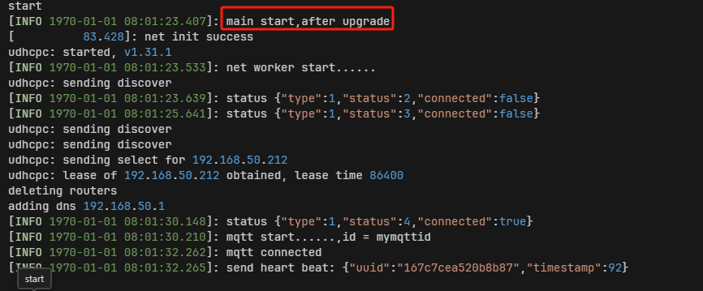

# DejaOS Device Upgrade Demo Project

This is a device remote upgrade demo project based on MQTT protocol, including both client (device side) and server (server side) components. The project demonstrates how to implement remote device monitoring and OTA upgrade functionality through MQTT messaging.

## Project Overview

This project consists of two main components:

- **Client (Device Side)**: Device client based on DejaOS platform, responsible for connecting to MQTT Broker, sending heartbeat messages, receiving upgrade commands, and executing OTA upgrades
- **Server (Server Side)**: Web server based on Node.js, providing device monitoring interface, MQTT message processing, and upgrade package download service

> MQTT Broker can use any established third-party MQTT software and platforms, EMQX is recommended
> The device-side program currently uses DW200_V10 device. To run on other devices, you need to open app.dxproj to reselect device type and choose matching component versions

## Functional Workflow

Mainly used to demonstrate how to upgrade multiple devices in batches through MQTT. The main principles are:

1. Device side notifies server through Broker that device is online and pushes device's unique identifier uuid to server
2. Device side subscribes to topic 'upgrade_demo/v1/cmd/' + uuid + '/upgrade', only subscribing to topics with device's own uuid
3. Server prepares upgrade package that can be downloaded through http url
4. Server selects one or more online devices, pushes download url and upgrade package md5 to specified devices, topic is 'upgrade_demo/v1/cmd/' + uuid + '/upgrade'
5. After receiving, device side downloads url through dxOta and verifies md5, after restart, upgrade package will overwrite current application

### Device Side Features

- ✅ Start MQTT worker thread after successful network connection
- ✅ MQTT connection management and reconnection
- ✅ Send heartbeat messages periodically (5-minute intervals)
- ✅ Receive and process upgrade commands
- ✅ HTTP download upgrade packages with MD5 verification
- ✅ Automatically execute OTA upgrade and restart

### Server Side Features

- ✅ Real-time Web device monitoring interface
- ✅ MQTT message subscription and processing
- ✅ Device online/offline status management
- ✅ Upgrade package HTTP download service
- ✅ Configurable server IP address
- ✅ One-click sending upgrade commands to specified devices

### Server Startup

```bash
# Enter server directory
cd server

# Install dependencies
npm install

# Start server
node ./index.js
```

After server startup, visit `http://localhost:3000` to view monitoring interface.


After device upgrade:


### Device Side Startup

The difference between upgrade package and original device application is the print content difference in main.js:

1. **Before upgrade**:
   

2. **After upgrade**:
   

## MQTT Configuration

### Connection Parameters

```javascript
// Default MQTT configuration (can be modified as needed)
mqttAddr: "tcp://101.200.139.97:51883";
clientId: "Device serial number";
username: "upgrade_demo";
password: "upgrade_demo_pwd";
```

### Topic Description

| Topic                                | Direction | Description                           |
| ------------------------------------ | --------- | ------------------------------------- |
| `upgrade_demo/v1/event/heart`        | Uplink    | Device heartbeat message              |
| `upgrade_demo/v1/event/offline`      | Uplink    | Device offline message (will message) |
| `upgrade_demo/v1/cmd/{uuid}/upgrade` | Downlink  | Device upgrade command                |
| `upgrade_demo/v1/cmd/upgrade_reply`  | Uplink    | Device upgrade reply                  |

### Message Format

All MQTT messages use JSON format:

```json
{
  "serialNo": "Device serial number/random string",
  "uuid": "Device unique identifier",
  "data": {},
  "timestamp": "10-digit timestamp"
}
```

#### Upgrade Command Message Example

```json
{
  "serialNo": "ABC123DEF456",
  "url": "http://192.168.1.100:3000/ota/upgrade.dpk",
  "md5": "d41d8cd98f00b204e9800998ecf8427e",
  "timestamp": "1704067200"
}
```

## Project Structure

```
dw200_mqtt_upgrade/
├── client/                    # Device side code
│   ├── src/
│   │   ├── main.js           # Main program entry
│   │   └── mqttworker.js     # MQTT worker thread
│   └── app.dxproj            # DX project configuration file
├── server/                    # Server side code
│   ├── index.js              # Node.js server main file
│   ├── index.html            # Web monitoring interface
│   ├── package.json          # Node.js project configuration
│   └── upgrade.dpk           # Upgrade package file
└── README.md                 # Project documentation 
```
## Device Compatibility

This demo currently runs on DW200_V10 devices. To run on other devices, simply update the corresponding modules as needed.
