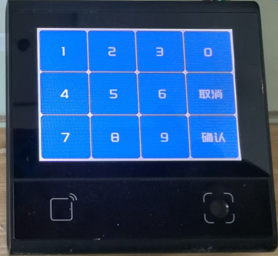

# DW200 Combined Access Control Application

## 🎯 Overview

This is a **comprehensive hotel room access control application** for DW200_V10 devices that combines multiple authentication methods with a built-in web testing interface. Perfect for hotels, offices, and any facility requiring flexible access control.

### Key Features

- ✅ **QR Code Authentication** - Scan QR codes for room access
- ✅ **RFID/NFC Card Authentication** - Use contactless cards
- ✅ **PIN Code Authentication** - 4-digit PIN entry via touchscreen
- 🌐 **Web Test Interface** - HTTP server on port 8080 for easy testing without physical hardware
- 🗄️ **SQLite Database** - Offline credential storage with 2000+ entry capacity
- 🔊 **Audio Feedback** - Success/failure sounds via PWM buzzer
- 📺 **Visual Feedback** - Success (绿色 "成功!") / Failure (红色 "失败!") popups on display
- ⚡ **GPIO Door Lock Control** - Automated relay control (2s default unlock time)
- 🔧 **Fully Configurable** - Over 50 configuration parameters

---

## 📸 Screenshots

### Main Interface


### Password Input Interface


---

## 🚀 Quick Start

### 1. Run the Application

The application automatically starts and launches a web server on **port 8080**.

### 2. Access Web Interface

Open your browser and navigate to:
```
http://localhost:8080
```

Or use the device IP address:
```
http://[DEVICE_IP]:8080
```

### 3. Test Authentication Methods

The web interface provides three testing sections:

#### 📱 QR Code Simulation
Enter test codes like:
- `HOTEL-ROOM-101-GUEST-12345`
- `HOTEL123456`
- `TESTQR001`

Click **"Skeniraj QR Kod"** → Door unlocks! ✅

#### 💳 RFID Card Simulation
Enter card IDs like:
- `AABBCCDD`
- `12345678`
- `CARD0001`

Click **"Skeniraj Karticu"** → Access granted! ✅

#### 🔢 PIN Code Simulation
Enter 4-digit PINs:
- `1234`
- `5678`
- `0000`

Click **"Unesi PIN"** → Success! ✅

---

## 📚 Documentation

| Document | Description |
|----------|-------------|
| [README_DEMO.md](README_DEMO.md) | Detailed technical documentation (English) |
| [README_QUICK_START.md](README_QUICK_START.md) | Quick start guide (Croatian) |
| [ZADATAK_OSTVAREN.md](ZADATAK_OSTVAREN.md) | Implementation report (Croatian) |
| [PROJEKT_SAZETAK.md](PROJEKT_SAZETAK.md) | Project summary (Croatian) |

---

### Hardware Interface Support

- **GPIO Control**: Relay control for door locks and other devices
- **PWM Audio**: Buzzer control for audio feedback
- **Network Connectivity**: Ethernet, WiFi, and 4G support
- **QR Code Scanner**: High-performance barcode/QR code recognition
- **NFC Reader**: M1 card and EID support with configurable sectors
- **Audio System**: Voice prompts and sound feedback
- **UART Bluetooth**: BLE communication support
- **Watchdog**: System stability monitoring

### User Interface

- **Modern UI**: Clean and intuitive interface design
- **Multi-language Support**: Chinese and English language options
- **Customizable Themes**: Configurable backgrounds and fonts
- **Real-time Status**: Network, MQTT, and system status indicators
- **Responsive Design**: Support for multiple screen orientations

## 🧪 Test Data

The application automatically initializes test credentials on first run (valid for 1 year):

### QR Codes (Type 100)
```
HOTEL-ROOM-101-GUEST-12345
HOTEL-ROOM-102-GUEST-67890
HOTEL123456
TESTQR001
STAFF-KEY-ADMIN
```

### RFID Cards (Type 200)
```
AABBCCDD
11223344
12345678
ABCD1234
CARD0001
```

### PIN Codes (Type 300)
```
1234
5678
0000
9999
1111
```

---

## 🔌 API Endpoints

The web server exposes REST API endpoints for programmatic testing:

| Endpoint | Method | Description | Payload |
|----------|--------|-------------|---------|
| `/api/qr` | POST | Simulate QR code scan | `{"code": "QR_STRING"}` |
| `/api/card` | POST | Simulate RFID card | `{"code": "CARD_ID"}` |
| `/api/pin` | POST | Simulate PIN entry | `{"code": "1234"}` |
| `/api/db/add-qr` | POST | Add QR code to database | `{"code": "NEW_QR"}` |
| `/api/db/add-card` | POST | Add card to database | `{"code": "NEW_CARD"}` |
| `/api/db/add-pin` | POST | Add PIN to database | `{"code": "1234"}` |

### Example cURL Requests

```bash
# Simulate QR code
curl -X POST http://localhost:8080/api/qr \
  -H "Content-Type: application/json" \
  -d '{"code":"HOTEL123456"}'

# Simulate RFID card
curl -X POST http://localhost:8080/api/card \
  -H "Content-Type: application/json" \
  -d '{"code":"AABBCCDD"}'

# Simulate PIN
curl -X POST http://localhost:8080/api/pin \
  -H "Content-Type: application/json" \
  -d '{"code":"1234"}'
```

---

## ⚙️ Configuration

Key configuration parameters in `src/config.json`:

```json
{
  // Door Lock
  "doorInfo.openTime": 2000,       // Unlock duration (ms)
  "doorInfo.openTimeout": 10,      // Door alarm timeout (s)
  "doorInfo.openMode": 0,          // 0=normal, 1=always open, 2=always closed
  
  // Audio
  "sysInfo.volume": 60,            // Speaker volume (0-60)
  "sysInfo.volume2": 100,          // Button sound (0-100)
  "sysInfo.volume3": 100,          // Buzzer volume (0-100)
  
  // UI
  "sysInfo.language": "CN",        // "CN" or "EN"
  "uiInfo.rotation": 1,            // Display rotation (0-3)
  
  // Database
  "doorInfo.offlineAccessNum": 2000  // Max offline credentials
}
```

---

## Architecture

### Directory Structure

```
src/
├── view/                    # UI Components
│   ├── mainView.js         # Main interface
│   ├── passwordView.js     # Password input interface
│   └── popWin.js           # Popup windows
├── service/                 # Business Services
│   ├── accessService.js    # Access control logic
│   ├── sqliteService.js    # Database operations
│   ├── mqttService.js      # MQTT communication
│   ├── codeService.js      # QR code processing
│   ├── nfcService.js       # NFC card processing
│   ├── configService.js    # Configuration management
│   └── ...
├── common/                  # Shared Utilities
│   ├── utils/              # Utility functions
│   └── consts/             # Constants definitions
├── main.js                 # Application entry point
├── controller.js           # Main controller
├── driver.js               # Hardware drivers
├── screen.js               # UI management
├── services.js             # Service orchestration
└── config.json             # Default configuration
```

### Core Components

#### 1. Main Controller (`main.js`)

- Application bootstrap and initialization
- Worker thread management
- Event bus setup
- System lifecycle management

#### 2. Hardware Drivers (`driver.js`)

- **GPIO Driver**: Door lock control and digital I/O
- **PWM Driver**: Buzzer and audio feedback
- **Network Driver**: Ethernet/WiFi/4G connectivity
- **Scanner Driver**: QR code and barcode recognition
- **NFC Driver**: RFID card reader interface
- **Audio Driver**: Voice prompts and sound effects
- **UART BLE Driver**: Bluetooth communication
- **MQTT Driver**: Message queue telemetry transport

#### 3. UI System (`screen.js` + `view/`)

- **Main View**: Primary user interface with status indicators
- **Password View**: Secure PIN entry interface
- **Popup System**: Toast notifications and alerts
- **Theme Engine**: Customizable appearance and layouts

#### 4. Service Layer (`service/`)

- **Access Service**: Authentication and authorization logic
- **Database Service**: SQLite-based data persistence
- **Test Data Service**: Automatic test credential initialization (NEW)
- **Network Service**: Connection management and monitoring
- **Configuration Service**: Settings management and validation

---

## 🔧 Troubleshooting

### Web interface not working
- Check if application is running
- Verify port 8080 is not in use
- Check logs: `/app/data/log/app.log`

### Authentication always fails
- Verify test data is loaded in database
- Check code format (exact match required)
- Verify validity period (startTime/endTime)

### GPIO not activating lock
- Check GPIO pin configuration (default: pin 105)
- Verify hardware connections
- Check `doorInfo.openMode` setting

---

## 📝 Logs

Application logs are saved to:
```
/app/data/log/app.log
```

For real-time log monitoring:
```bash
tail -f /app/data/log/app.log
```

---

## 🚀 Production Deployment

For production hotel use:
1. Connect to **MQTT broker** for centralized management
2. Integrate with **reception system**
3. Implement **time-based access** (check-in/check-out)
4. Enable **alarm system** for unauthorized access
5. See `plan_razvoja_recepcije.md` for details

---

## 📊 Project Statistics

| Metric | Value |
|--------|-------|
| New files created | 5 |
| Modified files | 1 |
| Lines of new code | ~1,100 |
| API endpoints | 6 |
| Test credentials | 15 |
| Authentication methods | 3 |
| Documentation pages | 5 |

---

## 🎓 DejaOS Modules Used

| Module | Purpose |
|--------|---------|
| dxHttpServer | Web server |
| dxEventBus | Event-driven architecture |
| dxGpio | GPIO control (door lock) |
| dxPwm | PWM for buzzer |
| dxNfc | RFID reader |
| dxCode | QR code scanner |
| dxUi | Display management |
| dxConfig | Configuration |
| dxLogger | Logging system |
| dxStd | Standard functions |
| dxMap | Key-value storage |
| dxMqtt | MQTT client |

---

## 📄 License

This project is part of the DejaOS ecosystem.

---

## ✨ Version Information

**Version**: dw200_v10_access_v2.0.2.3  
**Release Date**: 2025-11-22  
**Type**: Demo with web test interface

---

## 👨‍💻 Development

Developed as a demonstration project for DW200 v10 hotel access control system.

**Features implemented**:
- ✅ Multi-method authentication (QR/RFID/PIN)
- ✅ Web-based testing interface
- ✅ Automatic test data initialization
- ✅ Complete hardware integration
- ✅ Visual and audio feedback
- ✅ Comprehensive documentation

---

**Happy Testing! 🎉**

For detailed documentation, see [README_DEMO.md](README_DEMO.md)  
For quick start guide (Croatian), see [README_QUICK_START.md](README_QUICK_START.md)

