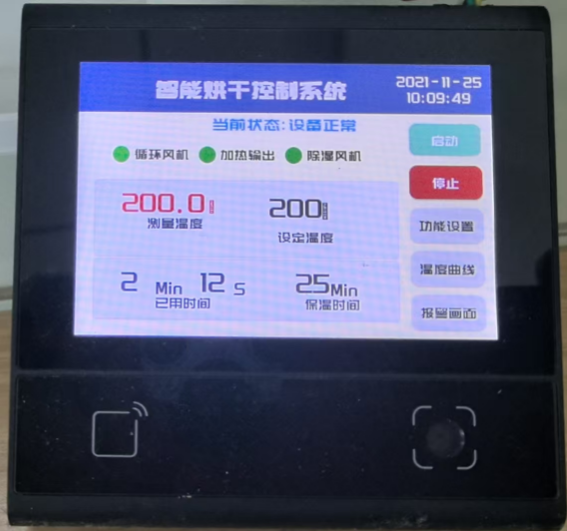

# Smart Drying Control System UI Demo

This is a UI demo project that mimics industrial control system smart panels, showcasing the design and interaction of modern industrial equipment operation interfaces.

This demo is a pure UI demonstration that simulates the operation interface of a smart drying control system. It primarily demonstrates the usage of the dxUi module.

**Note: This is only a UI demonstration and does not include any actual device control logic.**

## Device Compatibility

This demo currently runs on DW200_V10 devices. To run on other devices, simply update the corresponding modules as needed.
