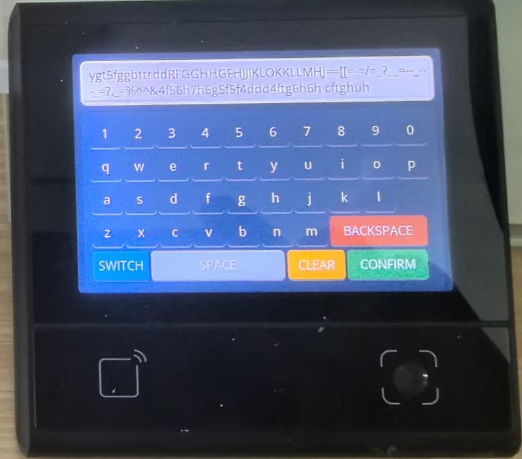

# DW200_V10 Full Keyboard UI Demo

## Overview

This is a **UI demonstration project** built with the dxUi module for the DW200_V10 device. It showcases a complete full keyboard input interface with **no actual business logic** - purely focused on UI layout, interactions, and visual presentation.

## Demo Features

### ⌨️ Multi-Layout Keyboard System

- **English Keyboard**: Lowercase letters with numbers and function keys
- **English Uppercase Keyboard**: Uppercase letters with numbers and function keys
- **Symbol Keyboard**: Special characters and symbols for extended input
- **Seamless Layout Switching**: Single button to cycle through all keyboard types

### 🎯 Smart Input Management

- **Real-time Input Display**: Live preview of typed content
- **Dynamic Key Mapping**: Efficient button reuse without recreation
- **Responsive Layout**: Optimized for small screen devices
- **Visual Feedback**: Color-coded keys for different functions

### 🔧 Function Keys

- **SWITCH**: Cycle through keyboard layouts (English → Uppercase → Symbol → English)
- **SPACE**: Insert space character
- **CLEAR**: Clear all input content
- **CONFIRM**: Confirm input and close keyboard
- **BACKSPACE**: Delete last character

## Screenshots

### Main Interface


### Keyboard Interface



## Core Modules

### main.js

Application entry point:

- UI initialization and context setup
- Main loop for UI refresh
- Module loading and startup

### page.js

Main page logic and keyboard implementation:

- **Main Interface**: Title bar, input display, and keyboard button
- **Keyboard View**: Complete keyboard layout with input display
- **Layout Management**: Dynamic keyboard type switching
- **Input Handling**: Character input and function key processing
- **Event System**: Click handling and UI updates

### viewUtils.js

UI utility library providing:

- Font management with predefined font sizes (16, 20, 24)
- Reusable UI components (buttons, labels)
- Consistent styling and layout utilities

## Keyboard Layout Design

### English Keyboard

```
1 2 3 4 5 6 7 8 9 0
q w e r t y u i o p
a s d f g h j k l
z x c v b n m [BACKSPACE]
[SWITCH] [SPACE] [CLEAR] [CONFIRM]
```

### English Uppercase Keyboard

```
1 2 3 4 5 6 7 8 9 0
Q W E R T Y U I O P
A S D F G H J K L
Z X C V B N M [BACKSPACE]
[SWITCH] [SPACE] [CLEAR] [CONFIRM]
```

### Symbol Keyboard

```
! @ # $ % ^ & * ( )
~ ` ! . ? / < > , '
( ) - _ = + [ ] { }
| \ ; : " . ? [BACKSPACE]
[SWITCH] [SPACE] [CLEAR] [CONFIRM]
```

## Technical Implementation

### Efficient Key Management

- **Mapping System**: Uses row-column mapping for efficient key updates
- **Button Reuse**: Updates existing buttons instead of recreating them
- **Event Handling**: Unified click handling through position mapping
- **Memory Optimization**: Minimal object creation during layout switches

### UI Design Principles

- **Consistent Spacing**: 3px horizontal, 6px vertical key spacing
- **Color Coding**: Different colors for different key types
- **Responsive Sizing**: Adaptive key widths for special keys
- **Clean Layout**: Minimal interface with focus on functionality

## Usage Flow

1. **Launch**: Click "Open Full Keyboard" button on main interface
2. **Input**: Type using the keyboard interface
3. **Switch Layouts**: Use SWITCH button to change keyboard type
4. **Manage Input**: Use CLEAR to reset or BACKSPACE to delete
5. **Complete**: Use CONFIRM to close keyboard and return to main interface

## Device Compatibility

This demo currently runs on DW200_V10 devices. To run on other devices, simply update the corresponding modules as needed.

## Project Structure

```
dw200_keyboard/
├── src/
│   ├── main.js          # Application entry point
│   ├── page.js          # Main page and keyboard logic
│   └── viewUtils.js     # UI utility library
├── dxmodules/           # DW200_V10 UI framework modules
├── resource/            # Font and resource files
└── app.dxproj          # Project configuration
```

**Note: This is only a UI demonstration and does not include any actual input processing or data storage logic.**
