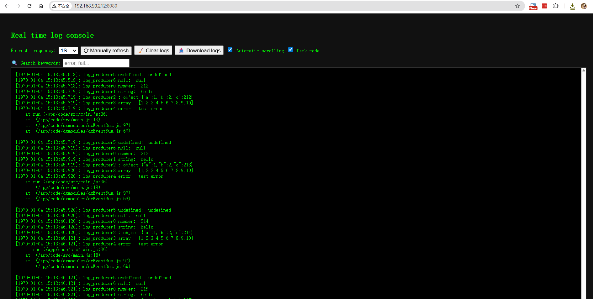

# WebLogCat Demo - Real-time Log Viewer

A demonstration of real-time log viewing through an embedded HTTP server running on device, showcasing multi-threaded log collection via shared queue.

During application debugging, we can typically view real-time logs through VSCode(DejaOS Plugin). However, for devices in production environments, visual real-time log viewing becomes impossible. This demo provides a solution approach and implementation for this challenge.



## Demo Overview

This demo illustrates how to implement real-time log monitoring on embedded devices by:

- **Running an HTTP server directly on the device**
- **Using multi-threaded shared queue for log collection**
- **Providing browser-based real-time log viewing**
- **Supporting various JavaScript data types in log output**

## Core Technical Features

### 1. Multi-threaded Log Collection

**Main Thread (`main.js`)**

- Produces logs continuously
- Pushes logs to shared queue
- Handles network connection management

**Worker Thread (`log_httpserver.js`)**

- Runs HTTP server on port 8080
- Consumes logs from shared queue
- Serves logs via REST API

### 2. Shared Queue Communication

```javascript
// Producer (main thread)
const queue = dxQueue.get("log_pipe");
queue.push(logContent);

// Consumer (worker thread)
const queue = dxQueue.get("log_pipe");
queue.pop(); // Get logs for HTTP response
```

**Queue Features:**

- **Thread-safe**: Supports concurrent access from multiple threads
- **Memory bounded**: Maximum 1000 entries to prevent memory overflow
- **FIFO ordering**: First-in-first-out log retrieval

### 3. Device HTTP Server

**Embedded Web Server:**

- Lightweight HTTP server running directly on device
- Serves static web interface
- Provides `/fetchLog` API endpoint
- No external dependencies required

**API Endpoint:**

- `GET /fetchLog` - Returns up to 100 recent log entries
- `GET /` - Serves the web interface (index.html)

### 4. Universal Log Function

The `logcat()` function demonstrates handling multiple JavaScript data types:

```javascript
// Multi-parameter support with rest operator
logcat("User login", { userId: 123, name: "John" }, "success");
// Output: [2024-01-15 10:30:45.123]: User login {"userId":123,"name":"John"} success
```

**Supported Data Types:**

- **Strings**: Direct output
- **Numbers**: Direct output
- **Objects**: JSON serialization
- **Arrays**: JSON serialization
- **Errors**: Message + stack trace
- **undefined/null**: Converted to string literals

## Demo Flow

1. **Device Startup**: Network connection established
2. **Thread Creation**: Worker thread spawned for HTTP server
3. **Log Production**: Main thread continuously generates sample logs
4. **Queue Operations**: Logs pushed to shared queue (thread-safe)
5. **HTTP Serving**: Worker thread serves logs via web API
6. **Browser Access**: Real-time log viewing at `http://192.168.50.212:8080`,192.168.50.212 is the device IP


## Device Compatibility

This demo currently runs on DW200_V10 devices. To run on other devices, simply update the corresponding modules as needed.